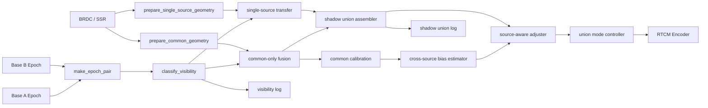

# 双站 VRS 重构实现过程

## 1. 重构背景

当前程序最初实现的是一个可运行的双站 VRS 原型：

1. 接收双基站 RTCM 观测流。
2. 提取两站 ARP 坐标并生成虚拟中点。
3. 对两站共同可见卫星做星历驱动的几何改正。
4. 估计接收机钟差、固定公共卫星双差模糊度。
5. 输出虚拟站 RTCM。

这条链路已经能工作，但它的核心逻辑长期堆叠在 `ntrip_rtcm_obs.c` 的少数大函数中，存在三个问题：

1. “只处理公共卫星”是隐式行为，代码里通过大量 `continue` 实现，不利于后续扩展。
2. 历元同步、卫星分类、几何计算、融合输出耦合在一起，审查和测试成本越来越高。
3. 后续若要支持 `A ∪ B` 的双站并集 VRS，现有结构缺少明确的扩展入口。

因此，项目开始按《双站 VRS 重构设计方案》推进分阶段重构。

---

## 2. 重构总路线

本次重构按四个阶段推进：

| 阶段 | 目标 |
|---|---|
| 阶段 1 | 显式化当前 `common-only` 架构，抽出历元配对、可见性分类、几何准备 |
| 阶段 2 | 计算 A-only / B-only 单站搬移结果，但暂不对外发布 |
| 阶段 3 | 引入跨源偏差估计和 union 发布控制，开始受控输出 `A ∪ B` |
| 阶段 4 | 补齐状态机、遥测、回放测试和产品化收口 |

当前仓库已经完成 **阶段 1、阶段 2**，并完成了 **阶段 3 的第一轮实现**。

---

## 3. 阶段 1 的实现目标

阶段 1 不追求新增能力，而是先把现有能力拆清楚，并保证输出语义不变。

### 目标

1. 抽出双站历元配对逻辑。
2. 新增显式卫星可见性分类。
3. 抽出公共卫星几何准备模块。
4. 将当前融合路径明确为 `common-only`。
5. 在日志中输出 `A-only / B-only / common` 数量，为后续并集扩展做准备。

### 约束

1. 当前仍只发布公共卫星观测。
2. 不改变现有 RTCM 输出结构。
3. 不提前引入跨源并集输出。

---

## 4. 阶段 1 已完成的代码改造

### 4.1 新增历元配对模块

新增：

```c
epoch_pair_t
make_epoch_pair(...)
```

作用：

1. 将双站历元配对从 `try_synth_virtual_obs()` 中抽离。
2. 统一负责判断两个历元是否能进入同一轮融合。
3. 当前严格要求双站历元时间差不超过 `1 ms`。

这样后续要接入更复杂的历元同步策略时，不需要继续膨胀主流程函数。

### 4.2 新增卫星来源分类

新增：

```c
sat_source_t
sat_visibility_t
visibility_set_t
classify_visibility(...)
```

当前每个历元会被明确分成：

1. `SRC_A_ONLY`
2. `SRC_B_ONLY`
3. `SRC_COMMON`

阶段 1 仍然只消费 `SRC_COMMON`，但代码已经第一次拥有了完整的 A/B 可见性视图。

### 4.3 抽出公共卫星几何服务

新增：

```c
prepare_common_geometry(...)
```

该模块负责：

1. 卫星位置与钟差计算。
2. A / B / V 三点几何距离。
3. 电离层与对流层改正项。
4. 保持当前 A 索引缓存布局不变，以避免阶段 1 改动算法结果。

这样 `build_virt_obs_with_eph()` 不再同时承担“准备输入”和“完成融合”两种职责。

### 4.4 将公共卫星路径显式化

已重构：

```c
build_virt_obs_apollonius(...)
build_virt_obs_with_eph(...)
```

变化：

1. 两个融合函数不再隐式遍历 A 站后再查 B 站是否存在。
2. 现在都通过 `visibility_set_t` 显式只处理 `SRC_COMMON`。
3. 输出结果保持 `common-only`，但代码语义更清晰。

### 4.5 增加可见性日志

每历元日志现在会附带：

```text
vis A=<n_a_only> B=<n_b_only> common=<n_common>
```

这让现场调试可以直接看出：

1. 当前是否确实存在并集扩展空间。
2. 共同星数量是否足够支撑后续公共校准。
3. 后续 union 模式能否从当前数据中获益。

---

## 5. 阶段 1 同步完成的正确性修复

在重构开始前，已先完成一轮会影响融合正确性的修复：

### 5.1 载波相位不再被重编码前重写

对不支持的 MSM 码，只允许保持同一物理观测的重映射。

已移除原先用：

```c
L = P / lambda
```

去重建载波的行为，避免破坏双差固定后的整周结构。

### 5.2 多系统钟差改为分星座估计

当前接收机钟差估计已按星座分别处理，不再把 GPS、BDS、Galileo 等系统混成一个统一中值。

### 5.3 无有效星历输出时恢复 fallback

星历路径只有在实际生成有效观测后才算成功，否则继续回退到 fallback。

### 5.4 移除固定 18 颗卫星上限

保留全部有效观测，由 MSM 拆包逻辑自行处理 `nsat * nsig <= 64`。

---

## 6. 阶段 2 已完成的代码改造

### 6.1 新增内部虚拟观测结构

新增：

```c
virt_obs_t
virt_epoch_t
```

作用：

1. 为内部候选观测保留 `source`。
2. 将 `common / A-only / B-only` 放进同一套候选集合中。
3. 为后续真正的 union 发布层准备统一输入。

### 6.2 新增单站几何服务

新增：

```c
single_geom_t
prepare_single_source_geometry(...)
```

该模块会分别按 A 或 B 的单站观测计算：

1. 源站到卫星的几何距离。
2. 虚拟点到卫星的几何距离。
3. 两点的电离层、对流层差分。

### 6.3 新增单站搬移计算

新增：

```c
transfer_single_source_candidates(...)
```

对于 A-only / B-only 卫星，当前内部候选观测按下面思路搬移：

```text
obs_C = obs_source
      + (rho_C - rho_source)
      + (iono_C - iono_source)
      + (trop_C - trop_source)
```

其中：

1. 伪距按米搬移。
2. 载波按波长换算后搬移。
3. 保留原始观测来源与 `LLI`。

### 6.4 新增影子并集组装

新增：

```c
assemble_shadow_union_candidates(...)
```

当前会在内部把：

1. `common`
2. `A-only`
3. `B-only`

组装成一份 **shadow union**。

这份集合在阶段 2 只用于日志和验证；阶段 3 在质量门控通过后，会从中挑选可发布成员进入对外 RTCM。

### 6.5 增加阶段 2 诊断日志

星历路径日志现在会附带：

```text
shadow A=<n_a_only> B=<n_b_only> union=<n_total>
```

这样可以直接看到：

1. 有多少单站独有卫星已经完成内部搬移。
2. 如果后续开放 union，理论上可扩展到多少颗星。
3. 当前是否值得进入下一阶段的跨源偏差建模。

---

## 7. 阶段 3 已完成的代码改造

### 7.1 新增基线状态

新增：

```c
baseline_state_t
make_baseline_state(...)
```

当前第一版以两站 1005/1006 ARP 构成的已知基线作为固定来源，并把基线长度纳入并集发布门控。

### 7.2 新增公共星定标输出

`build_virt_obs_with_eph()` 现在额外输出：

```c
common_cal_t
```

它保留每个星座的 A/B 钟差估计、有效性和参与卫星数，为后续单站观测统一到公共输出帧提供码观测偏差基准。

### 7.3 新增跨源偏差估计

新增：

```c
cross_source_bias_state_t
estimate_cross_source_bias(...)
```

当前按两条路径估计：

1. 码观测：按星座使用 `clk_B_sys - clk_A_sys` 作为 A/B 帧差。
2. 载波：按星座和信号，用已固定公共星估计 `B-aligned frame - A frame`，并要求至少 `2` 颗公共星、相位散布不超过 `0.10 cycle`。

### 7.4 新增来源感知发布策略

新增：

```c
adjust_single_source_for_union(...)
```

阶段 3 第一版采用保守规则：

1. A-only 码观测在码偏差可用时可进入 union。
2. A-only 载波只有在同频点公共相位偏差稳定时才可进入 union。
3. B-only 码观测在码偏差可用时可进入 union。
4. B-only 载波暂不发布；当前已进入对称映射 dry-run，并新增多历元 bridge 状态机，只有连续满足 `3/3`、`rms <= 0.15 cyc` 的历元才会进入内部 `fixed`。

### 7.5 新增并集发布控制器

新增：

```c
publish_plan_t
decide_publish_plan(...)
```

只有同时满足以下条件，输出才会从 `common-only` 切换为 `union`：

1. 当前走星历路径。
2. 基线有效且固定。
3. 共视公共星不少于 `4` 颗。
4. 公共星残差 RMS 不超过 `1.0 m`。
5. 至少存在一颗通过偏差校准的额外候选星。

任一条件不满足，都会继续退回 `common-only`；没有星历时仍走 `fallback`。

### 7.6 增加阶段 3 诊断日志

每历元日志现在会附带：

```text
mode=<union|common-only|fallback> reason=<...> extra=<n>
baseline=<m> fixed=<0|1>
publish A=<n> B=<n>
```

这样可以直接审查：

1. 当前是否真的进入了并集发布。
2. 为什么被降级。
3. 实际有多少 A-only / B-only 候选通过了发布前校准。

---

## 8. 当前代码结构



### 当前仍未实现

1. B-only 载波的正式发布门控。
2. 真实基线解算驱动的动态 fixed / float 状态。
3. 全链路模式切换防抖和更完整的遥测。
4. 回放测试、异常测试和产品化验收脚本。

---

## 9. 当前验收状态

### 已满足

1. `common-only` 仍保留为稳定降级路径。
2. 主流程已经具备显式历元配对。
3. 当前每历元已经可区分三类可见性。
4. 公共卫星几何计算已从融合函数中抽离。
5. A-only / B-only 已能在内部完成单站搬移。
6. 内部候选并集已经可以组装。
7. 公共星定标、跨源偏差估计和发布门控已接入。
8. 健康条件满足时，代码已具备受控输出 union 的能力。
9. 目标源文件已通过语法检查。

### 仍需补充的验证

1. 用真实双站回放数据比对重构前后的数值输出。
2. 验证新日志中的 `A-only / B-only / common` 数量与原始观测一致。
3. 验证 `shadow A / shadow B / shadow union` 与手工计算一致。
4. 验证 `mode / reason / extra` 在正常、共视不足、残差过大场景下的切换。
5. 对 fallback 路径补一组回放样例。

---

## 10. 下一阶段计划

阶段 4 将集中完成：

1. 将已接入的 `B-only bridge` 多历元状态机并入正式发布门控。
2. 模式状态机防抖和更完整的 QC / 遥测字段。
3. 回放测试、异常注入测试和长时间稳定性测试。
4. 评估 B-only 载波是否在长期稳定后进入条件放行。

阶段 4 的重点不再是“能不能发”，而是：

1. 模式切换是否稳定。
2. 降级原因是否能被长期观测和回放复现。
3. 并集输出是否在真实数据上持续优于 `common-only`。

---

## 11. 相关文档

1. `双站VRS融合方案分析.md`
2. `双站VRS重构设计方案.md`

---

## 12. 当前验证状态

已执行：

```bash
cc -std=c99 -Iinclude -fsyntax-only ntrip_rtcm_obs/ntrip_rtcm_obs.c
```

结果：

```text
pass
```

为完成实时验证，已顺带修复 `src/options.c`、`src/stream.c` 中的 macOS 兼容问题；当前已可成功构建 `ntrip_rtcm_obs` 目标。

---

## 13. 基站回代验证

### 13.1 验证方式

当前程序支持：

```bash
ntrip_rtcm_obs -v a ...
```

含义：

1. 将虚拟点放到第一个基站位置。
2. 以第一个基站作为真值站。
3. 对公共星先把 A 站原始观测平移到当前 VRS 的平均参考帧，再与合成观测比较。
4. 对 A-only 卫星额外做 `move-to-self` 自检，验证单站搬移是否会在零距离时引入误差。

### 13.2 2026-05-17 实时数据结果

使用：

1. `2435536` 作为基站 A / 回代真值站。
2. `2435540` 作为基站 B。
3. `BCEP00BKG0` 作为广播星历流。
4. `SSRC00CNE0` 作为 SSR 流。

抽取 `39` 个历元后得到：

| 指标 | 结果 |
|---|---:|
| 公共星码观测回代 RMS | `5.146 m` |
| 公共星码观测最小 / 最大 RMS | `4.555 / 5.514 m` |
| 公共星载波回代 RMS | `0.0148 cycle` |
| A-only move-to-self 码观测 RMS | `0.000000 m` |
| A-only move-to-self 载波 RMS | `0.000000 cycle` |

### 13.3 码观测残差分解

为继续定位当前约 `5 m` 的公共星码残差，`-v a` 模式现在会在每个历元额外输出两行诊断：

```text
clk-fit codes: G/1C:A8,B8 C/2I:A14,B14
code-resid: G/1C:n=8 Amed=... Bmed=... halfmed=... halfrms=... rej=...;
code-bias: G/1C:n=8 ab=... sigma=... valid=...;
```

含义：

1. `clk-fit codes`
   - 展示每个星座估钟差时，A / B 两站实际采用了哪些“首个有效伪距”码型。
   - 如果同一星座内同时出现多种码型，说明当前“按星座估钟差”会把不同码型混在一起。
2. `code-resid`
   - `Amed` / `Bmed`：该码型在 A / B 两站、去掉按星座钟差后的中位残差。
   - `halfmed`：`0.5 * (eps_A - eps_B)` 的中位数。
   - `halfrms`：该码型对现有 `rms((eps_A-eps_B)/2)` 的分组 RMS 贡献。
   - `rej`：因为 `|eps_A-eps_B| > 30 m` 被剔除的样本数。
3. `code-bias`
   - `ab`：按 `(星座, 码型)` 估计的 `B frame - A frame` 码偏差。
   - `sigma`：该码型样本围绕中位数的散布。
   - `valid`：是否通过当前 `n >= 2` 且 `sigma <= 3 m` 的发布门控。

判读建议：

1. 如果同一星座内不同码型的 `Amed` / `Bmed` 存在稳定分层，说明下一步应把码偏差模型从“按星座”细化为“按星座 + 码型”。
2. 如果 A、B 两站在同一 `(星座, 码型)` 下长期保持不同的残差中心，则说明存在明显的接收机间码偏差。
3. 如果 `clk-fit codes` 显示同一星座混用了多种码型，而不同码型的 `Amed` / `Bmed` 又明显不同，则当前“每星取首个有效伪距估钟差”的策略已经在污染钟差估计。

当前实现已把单站并集发布时的码偏差校准，从“按星座”升级为“按星座 + 码型”：

1. A-only / B-only 码观测只有在对应 `(星座, 码型)` 的 `code-bias valid=1` 时才可进入 union 候选。
2. union 质量门控仍保留 `1.0 m`，但改看去掉各码型固定偏移后的 `codeDetrend`，避免把稳定码间偏差误判成随机噪声。
3. 主日志同时保留原始 `rms((eps_A-eps_B)/2)` 与新的 `codeDetrend`，便于继续观察“系统偏差”和“随机散布”两类问题。

### 13.4 当前判断

1. 单站搬移链路本身是正确的，回到自身时没有引入可见误差。
2. 公共星载波融合链路基本健康，回代残差约为百分之一周量级。
3. 新的分解结果表明，当前 `5 m` 量级主要来自稳定的码型偏移，而不是随机多径：`G/1C`、`C/2I` 是当前钟差锚点，其余码型相对它们存在明显分层。
4. 因此当前实现已把码偏差模型细化到 `(星座, 码型)`，并继续保留原始 `1.0 m` union 门限。
5. 实时验证表明，去掉码型固定偏移后，`codeDetrend` 可降到约 `1 m` 左右；当对应码型校准稳定时，`union` 已可自然进入发布。
6. 当前最值得继续拆解的对象已经收敛到 `C/2I`：它的码型偏差 `sigma` 会在不同历元间显著波动，并直接决定 B-only 额外卫星能否通过发布门控。
