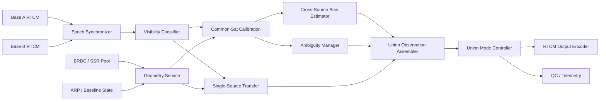
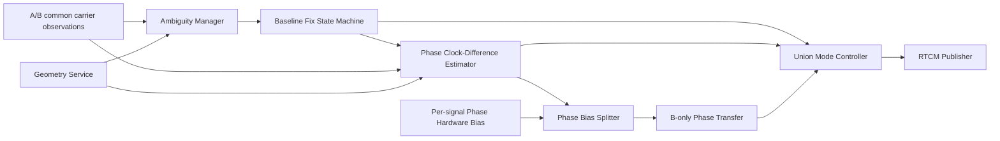
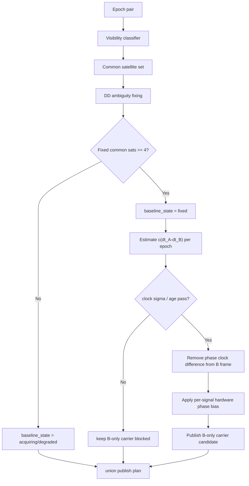

# 双站 VRS 重构设计方案

## 1. 设计目标

当前实现已经完成了基于公共卫星集合 `A ∩ B` 的清洁化融合。下一阶段目标是将系统重构为可支持 `A ∪ B` 的双站 VRS 架构，同时保留当前公共卫星融合路径作为稳定降级模式。

目标能力：

1. 区分 `A-only / B-only / common` 三类卫星。
2. 将单站独有卫星独立搬移到虚拟点 C。
3. 基于公共卫星逐历元估计跨站偏差，支撑混源输出。
4. 在条件不足时自动退化到 `common-only`，而不是输出不可信的并集观测。
5. 保持现有 RTCM 输出链路可复用，避免大范围重写编码层。

非目标：

1. 不在本阶段解决“无 L2 实测却生成 L2”的问题。
2. 不把当前单进程程序直接扩展成完整网络 RTK 平台。
3. 不把 rover 端私有解算逻辑耦合进服务端编码模块。

---

## 2. 目标架构



---

## 3. 模块级拆分

| 模块 | 主要职责 | 输入 | 输出 | 当前代码对应关系 |
|---|---|---|---|---|
| `epoch_synchronizer` | 对齐双站历元，形成同一处理批次 | A/B epoch snapshot | `epoch_pair_t` | 目前散落在 `try_synth_virtual_obs()` |
| `visibility_classifier` | 生成 `A-only / B-only / common` 卫星集合 | `epoch_pair_t` | `visibility_set_t` | 当前缺失 |
| `geometry_service` | 统一提供卫星位置、钟差、A/B/C 几何与大气项 | 星历、ARP、观测历元 | `sat_geom_map_t` | 目前内嵌在 `build_virt_obs_with_eph()` |
| `baseline_state` | 管理 A-B 基线、固定状态、质量指标 | ARP / 后续基线解 | `baseline_solution_t` | 当前缺失，只直接使用 1005 ARP |
| `common_sat_calibrator` | 基于公共卫星估计每系统钟差、公共残差、参考星候选 | `common set + geometry` | `common_cal_t` | 当前已有雏形 |
| `cross_source_bias_estimator` | 估计跨站、跨频点偏差，用于混源观测统一 | `common_cal_t` | `bias_state_t` | 当前缺失 |
| `ambiguity_manager` | 维护公共卫星 DD 固定、参考星切换、滑周状态 | common carrier obs | `ambiguity_state_t` | 当前已有，但只覆盖 common |
| `single_source_transfer` | 将 A-only / B-only 观测搬移到 C | 单站观测、geometry、bias | `virt_obs_t` | 当前缺失 |
| `union_observation_assembler` | 合并 common、A-only、B-only，形成候选虚拟观测集 | 多路虚拟观测 | `virt_epoch_t` | 当前仅有 common 输出 |
| `union_mode_controller` | 按质量决定 `union / common-only / fallback / mute` | QC、bias、baseline | `publish_plan_t` | 当前缺失 |
| `rtcm_output_encoder` | MSM 拆包、1005 周期发送、自检 | `publish_plan_t` | RTCM bytes | 当前已有 |
| `qc_telemetry` | 输出每历元质量信息和降级原因 | 全部中间状态 | 日志 / 指标 | 当前只有局部日志 |

---

## 4. 推荐的数据结构

### 4.1 卫星来源分类

```c
typedef enum {
    SRC_NONE = 0,
    SRC_A_ONLY,
    SRC_B_ONLY,
    SRC_COMMON
} sat_source_t;
```

### 4.2 可见性集合

```c
typedef struct {
    int sat;
    sat_source_t source;
    int idx_a;
    int idx_b;
} sat_visibility_t;

typedef struct {
    sat_visibility_t items[MAXOBS * 2];
    int n;
    int n_a_only;
    int n_b_only;
    int n_common;
} visibility_set_t;
```

### 4.3 跨站偏差状态

```c
typedef struct {
    int valid;
    int sys;
    int freq_slot;
    double bias_m;
    double sigma_m;
    int n_common;
    gtime_t time;
} cross_source_bias_t;
```

### 4.4 输出模式

```c
typedef enum {
    VRS_MODE_MUTE = 0,
    VRS_MODE_FALLBACK,
    VRS_MODE_COMMON_ONLY,
    VRS_MODE_UNION
} vrs_mode_t;
```

---

## 5. 关键数据流

### 5.1 公共卫星路径

1. 从 `visibility_set_t` 中取出 `common`。
2. 由 `geometry_service` 计算 A/B/C 的几何和大气项。
3. `common_sat_calibrator` 估计每系统钟差。
4. `ambiguity_manager` 维护公共卫星双差整数关系。
5. 生成高质量 `common` 虚拟观测。

### 5.2 单站独有卫星路径

1. `A-only` 观测只从 A 搬移到 C，继承 A 的模糊度。
2. `B-only` 观测只从 B 搬移到 C，继承 B 的模糊度。
3. 若要把 A-only 与 B-only 一起发布，必须先由 `cross_source_bias_estimator` 给出可用偏差状态。
4. `union_mode_controller` 决定是否允许进入最终输出。

### 5.3 输出路径

1. `union_observation_assembler` 形成候选集合。
2. `union_mode_controller` 依据质量门限决定输出模式。
3. `rtcm_output_encoder` 只关心已经批准发布的观测，不承担数学策略判断。

### 5.4 方案 B 模块设计图



### 5.5 方案 B 数据流图



这两张图把方案 B 拆成了三层：

1. `baseline_fix_state_machine`：只回答“当前双站载波关系是否已经稳定到可以相信”。
2. `phase_clock_difference_estimator`：只估计逐历元的 `c(dt_A-dt_B)`。
3. `phase_bias_splitter`：把全局钟差项和按频点的残余相位偏差拆开，避免继续混在同一个 `phase_bias_ab_cyc` 里。

这样做的好处是：

1. `baseline fixed` 不再是“坐标存在即固定”的占位布尔值。
2. 即使未来 `B-only` 载波仍暂时不放行，公共卫星侧的钟差估计器也能先独立验证。
3. 当质量不够时，系统可以明确退回 `common-only`，而不是把失败混进发布层。

### 5.6 当前实现约束

目前阶段 3 的第一版 `phase_clock_difference_estimator` 采用“码钟差锚定 + 相位整周展开”的办法：

1. 先从每个 `(system, code)` 的公共卫星中估计原始相位框架偏移。
2. 以同星座的码钟差 `clk_B - clk_A` 为粗锚点，将相位偏移按波长展开到最接近的整周分支。
3. 对同星座可用信号取中值，得到逐历元 `phase_clock_ab_m`。
4. 再从每个信号的原始相位框架偏移中扣除该公共钟差，剩下的部分记为 `phase_resid_bias_ab_cyc`。

这个残余项目前仍包含参考星单差模糊度常数与频点相关偏差，并不应被解释成纯硬件延迟。当前实现已经把“逐历元公共项”和“按频点残余项”分开，但它仍依赖码钟差做整周分支选择；在真正放开 `B-only` 载波前，还需要继续做：

1. 长时间连续性检查。
2. 参考星切换时的稳定性检查。
3. 码钟差异常时的拒绝逻辑。

### 5.7 当前门控策略

`phase_clock_difference_estimator` 进入“可用”状态前，必须同时满足：

1. `baseline_state = fixed`
2. 当前星座至少存在可用公共相位信号
3. 相位样本离散度 `sigma <= 0.10 m`
4. 相位钟差与码钟差锚点的差值绝对值 `<= 0.15 m`
5. 相邻历元的相位变化相对码锚变化创新量 `<= 0.15 m`
6. 当前历元没有参考星切换
7. 连续通过 3 个历元

只有满足以上条件，`phase_clock_diff_state` 才会从“能算”升级为“可用”。

### 5.8 B-only 载波的对称映射

进一步把 common 载波的参考框架写开后，可以得到一个更准确的结论：

1. common 载波当前本质上位于 A/B 两个相位参考帧的平均框架。
2. 因此 A-only 载波若要进入这个框架，应使用 `+0.5 * frame_offset`。
3. B-only 载波若要进入同一框架，应使用 `-0.5 * frame_offset`。

这意味着 B-only 并不一定需要先构造一个并不存在的 `N_A^s - N_B^s`；  
它可以依靠：

1. 公共卫星给出的逐历元相位钟差
2. 对应频点的相位残余项
3. B 站自身相对公共参考星的同接收机单差整数关系

进入与 common 一致的半平均整数框架。

### 5.9 当前仍然只做 dry-run 的原因

虽然对称映射在代数上成立，但正式放行前仍需先证明两件事：

1. B-only 到 B 站参考星的单差，在扣除几何与大气模型后确实稳定接近整数。
2. `-0.5 * frame_offset` 映射在基站回代场景下不会破坏自洽性。

因此当前实现将 B-only 载波推进到 `dry-run`：

1. 统计可对称映射的信号数。
2. 统计可被 B 站单差固定的桥接数。
3. 在 `-v b` 回代模式下检查映射后的自洽误差。
4. 使用多历元 bridge 状态机做防抖：
   - 候选桥接数至少 `3`
   - 当前历元必须 `3/3` 全部固定
   - `bridgeRms <= 0.15 cyc`
   - 连续 `3` 个历元满足后才进入 `fixed`
   - 已固定后允许最多 `2` 个坏历元进入 `degraded`

只有这些诊断长期稳定后，才进入正式发布门控。

---

## 6. 四阶段实现路线图

### 阶段 1：打地基，先把“谁是谁”说清楚

目标：

1. 抽出 `epoch_synchronizer`
2. 新增 `visibility_classifier`
3. 抽出 `geometry_service`
4. 将现有公共卫星路径重构为显式 `common-only` 模式

核心改动：

1. 新增 `visibility_set_t`
2. 将当前“遇不到另一站就 continue”的隐式交集逻辑，改成显式分类
3. 将 `satposs / geodist / ionmodel / tropmodel` 从大函数中抽离
4. 保证重构后输出结果与当前 `common-only` 基线一致

完成标志：

1. 不改变现有输出结果
2. 每历元日志能打印 `A-only / B-only / common` 数量
3. `build_virt_obs_with_eph()` 被拆成更小模块，但 common 结果数值一致

设计审查重点：

1. 分类结果是否稳定
2. 几何缓存是否按卫星而非按数组偶然顺序绑定
3. 重构是否保持现有回退行为

---

### 阶段 2：先实现“能搬”，但暂不允许混源发布

目标：

1. 新增 `single_source_transfer`
2. 支持 A-only、B-only 卫星搬移到 C
3. 引入 `union_observation_assembler`
4. 但最终仍默认只发布 `common-only`

核心改动：

1. 新增 `transfer_from_base_A()` / `transfer_from_base_B()`
2. 为每条虚拟观测打上内部来源标签
3. 建立 `virt_obs_t` 结构，先在内部把 `A-only / B-only / common` 都算出来
4. 只在日志和测试中验证 A-only、B-only，暂不发给 rover

完成标志：

1. 能正确计算 A-only、B-only 的 C 点观测
2. 这些观测在数值上满足单站搬移公式
3. 不影响当前生产输出

设计审查重点：

1. 单站载波搬移是否保留原整周关系
2. A-only/B-only 的大气改正是否与 common 使用同一套模型
3. 数据结构里是否保留了来源而不丢失

---

### 阶段 3：建立跨源统一框架，开始受控发布并集

目标：

1. 新增 `cross_source_bias_estimator`
2. 新增 `baseline_state`
3. 将跨站钟差差与硬件偏差组合为可审核状态
4. 引入 `source_aware_ambiguity_policy`
5. 在条件满足时，开启 `VRS_MODE_UNION`

核心改动：

1. 基于公共卫星、按系统/频点估计 `bias_AB`
2. 加入最小共视卫星数、方差、残差 RMS 门限
3. 明确 common 参考星策略，避免 rover 参考星落在不受控来源上
4. A-only、B-only 与 common 一起进入候选输出
5. 当基线未固定、共视星不足、偏差不稳定时，自动回到 `common-only`

完成标志：

1. 在健康数据下能输出 `A ∪ B`
2. 在坏数据下能自动降级
3. 所有模式切换都有明确日志原因

设计审查重点：

1. `bias_AB` 的定义是否唯一且不会重复扣除
2. 频点间偏差是否被错误混合
3. 混源发布后 rover 侧是否仍可形成可解释的整数关系
4. 基线固定状态是否真的被用于门控

---

### 阶段 4：产品化收口

目标：

1. 完成 `union_mode_controller`
2. 完成 QC/遥测体系
3. 补齐回放测试、异常测试、长时间稳定性测试
4. 清理 README 与运行说明

核心改动：

1. 引入模式状态机：
   - `MUTE`
   - `FALLBACK`
   - `COMMON_ONLY`
   - `UNION`
2. 每历元输出：
   - A-only / B-only / common 数量
   - 有效 `bias_AB`
   - `baseline_state`
   - 当前发布模式与降级原因
3. 增加回放测试集和黄金日志
4. 更新操作手册与质量阈值说明

完成标志：

1. 开机、热切换、丢星、恢复、滑周、偏差突变都能被解释
2. 长时间回放无不可解释模式震荡
3. 文档、日志、代码行为三者一致

设计审查重点：

1. 模式切换是否可预测
2. 日志是否足以支持现场排障
3. 复杂度是否仍被模块边界控制住

---

## 7. 设计审查方案

### 7.1 审查原则

1. 先审数学定义，再审代码组织。
2. 先审失效模式，再审理想场景。
3. 所有能影响整数性的变换，都必须能写出清楚公式。
4. 输出模块不得“偷偷修正”上游已经完成的数学结果。

### 7.2 必审问题清单

#### A. 数学正确性

1. A-only、B-only 的相位搬移公式是否严格保留模糊度整数性。
2. `bias_AB` 是否混合了钟差、硬件延迟、系统间偏差；若混合，定义是否稳定。
3. 每个系统/频点是否需要独立偏差状态。
4. common 参考星切换时，是否会影响 A-only/B-only 的一致性。

#### B. 数据建模

1. `sat_source_t` 是否贯穿到最终决策层。
2. 是否存在“分类后又被压扁回普通 `obsd_t`”而丢失来源的问题。
3. 几何缓存、偏差缓存、模糊度缓存的 key 是否统一。

#### C. 失效与降级

1. 共视卫星不足时是否自动回退。
2. 基线未固定时是否禁止 union。
3. 偏差 RMS 突增、滑周、失锁时是否触发降级。
4. 降级后是否能无缝恢复，而不是长时间卡死。

#### D. 接口与输出

1. 标准 RTCM 不能携带“来源标签”时，服务端输出策略是否仍自洽。
2. rover 若完全不感知来源，union 模式是否仍安全。
3. 是否需要扩展私有诊断通道，而不是企图把来源塞进 MSM。

#### E. 可测试性

1. 是否能对每一阶段做单元测试。
2. 是否有 A-only、B-only、common 三类卫星的最小回放样例。
3. 是否有多系统、多频点、偏差漂移、共视星骤降的回放样例。

---

## 8. 设计评审门禁

| 阶段 | 进入下一阶段前必须满足 |
|---|---|
| 阶段 1 | common-only 输出与当前版本一致，且分类统计正确 |
| 阶段 2 | A-only/B-only 内部搬移通过公式级验证，但仍不对外发布 |
| 阶段 3 | union 模式只在基线、共视、偏差三类条件全部满足时启用 |
| 阶段 4 | 长时回放、降级恢复、日志解释性全部通过 |

---

## 9. 关键风险

1. 标准 RTCM 不表达来源，可能限制“透明 union 输出”的安全边界。
2. `bias_AB` 若定义不清，会把多个偏差混在一起，后续难以维护。
3. 如果过早开放 union 输出，问题会在 rover 固定率上表现，而不是在服务端日志中立刻暴露。
4. 当前单文件实现已经偏重，若不先拆模块，后续会很快进入难以审查的状态。

---

## 10. 推荐实施顺序

1. 先完成阶段 1，并用现有数据确保行为不变。
2. 再做阶段 2，把并集能力先“算出来但不发布”。
3. 阶段 3 再引入偏差状态和 union 发布。
4. 最后阶段 4 做状态机、测试、文档与现场可运维性。

这条路线的好处是：每一阶段都能独立验收，不需要一口气把最难的跨源问题全压在一次重写里。
